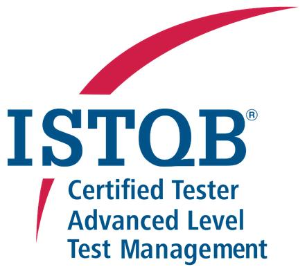

# Hi, I'm KJ 👋

## 🎯 Senior DevOps Engineer • Camunda 8 • Agentic AI & Process Automation • Sovereign Cloud • Inhouse • Remote-First

* I build the resilient **infrastructure for Agentic AI** within **governed, deterministic workflows**.
* My focus is on engineering **scalable**, **audit-ready** architectures for highly regulated industries where **data sovereignty**, **compliance**, and **autonomous execution** meet.

---

## 🚀 Core Competencies
*   **Top Skills:** Spring Boot • Kubernetes • Terraform • Camunda 8 • Agentic AI
*   **Engineering:** Java • Spring Security • Python • CI/CD Pipelines (GitHub, Tekton, Maven, OWASP, Sonar)
*   **Infrastructure & GitOps:** Linux • AWS (VPC, IAM) • Infrastructure as Code • Helm • ArgoCD
*   **Data:** SQL • PostgreSQL • AWS RDS Aurora
*   **Frontend & UI:** Client/Server communication • JavaScript foundation
*   **Observability & Compliance:** IT Observability (Grafana, AWS Cloudwatch) • Compliance as Code (DORA, KRITIS)
*   **Sovereign AI & Harness Engineering**: LLM Inference (vLLM, LM Studio) • Agentic Tooling & MCP Integration • Self-Hosted Agent Sandboxes (Roomote, Docker) • GitOps Integration
*   **Methodology & Leadership:** Scrumban • Trained ~150 colleagues in BPMN/DMN & ~20 in Camunda process development

---

## 🎓 Verified Credentials

* 

  
  
  
  

* ⏳ **In Preparation:** Certified Kubernetes Application Developer (CKAD)
* Please visit my badges for a detailed list of earned skills.

---

## 🔗 Connect with me

*  &nbsp; 
* Open for exchanges on Agentic AI & Sovereign Cloud architectures
* Please visit my professional profiles for professional history and career details.

---

## 💡 Portfolio Scope

* My professional role involves navigating the high-stakes complexities of making **critical trade-offs between quality, velocity, and cost** in a complex, large-scale enterprise landscape - these outputs remain confidential within corporate repositories.
* In contrast, this public space serves as a **distillation of that experience**, showcasing a modular, full-stack engineering approach.
* My **repositories isolate specific technologies or explore organizational patterns** at a meta-level to provide clear insights into my engineering DNA.
* Built entirely from scratch, my repos serve as sandboxed environments for **technology validation on my own sovereign hardware** and as a means for clear communication with stakeholders.

---

## 🛠️ Private Lab Setup

* While I rely on **AWS Cloud** and **GitHub Copilot** in my professional day-to-day work, my private lab is built differently - optimized for rapid prototyping, technological validation, and data sovereignty.
* **Hardware:** High-Power Desktop (16 GB GPU + 64 GB RAM) • NVIDIA Jetson Orin Nano (8 GB Unified Memory)
* **OS:** Debian-based distributions
* **IDE & Plugins:** IntelliJ IDEA • Maven Helper, GitToolBox • SpotBugs, TestMe, TestAutomation • Terraform & HCL • Kubernetes, Go Template • DevoxxGenie
* **Local AI Harness (Interactive Review):** LM Studio (`Gemma-4-12B-QAT`) • DevoxxGenie (IntelliJ) with MCP (`fetch-url-mcp`)
* **Remote AI Harness (Autonomous Software Development)**: Self-Hosted vLLM (`Qwen2.5-Coder-7B-Instruct-AWQ`) • Roomote Agent in Docker Sandboxes with automated PR delivery to local Gitea.

---

## GitHub Repositories

### [Sovereign Camunda Agent Lab](https://github.com/kj-hilger/sovereign-camunda-agent-lab)

* 

  
  

* Lightweight, ephemeral **DevOps lab** for rapidly spinning up a **Camunda 8 Agentic AI** process application together with an **LLM provider** on NVIDIA Jetson Orin Nano.
* Provision & operate enterprise-grade Camunda 8 with **Agentic Tool Calls** to LocalLLM on **Kubernetes** within minutes on your desk, no Internet connection needed during runtime and also no Token Budget.
* Optimized for the **NVIDIA Jetson Orin Nano**, a compact and cost-effective device that can be easily wiped and reprovisioned. It enables quiet, low-energy operation and is perfectly suited for portable, on-site demonstrations in air-gapped environments.
* Topics: `agentic-ai` `ai-automation` `bpmn` `camunda` `camunda-8` `devops` `edge-ai` `helm-chart` `java` `k8s` `kubernetes` `linux` `llm-orchestration` `local-llm` `ollama` `platform-engineering` `self-managed` `shell-script` `spring-boot` 

### Case Study: [Change Automation Core](https://github.com/kj-hilger/change-automation-core)

* 

  
  

* Impact: **Awarded for Delivery Velocity** at a leading European Financial Institution.
* **Streamlined production deployments** by reducing manual documentation overhead and cross-platform data handling **by up to 80%**.
* **Multi-Source Integration**: Orchestrates data from Jira (Agile PM), LeanIX (Metadata), Kubernetes (Deploy Strategies), Grafana (Metrics), and ServiceNow (ITSM) into a single source of truth.
* **Compliance-as-Code**: Engineered a Python-based tool to automate DORA, ITSM, GitOps and internal PM requirements, ensuring 100% adherence to standards.
* Topics: `compliance-as-code` `compliance-automation` `confluence` `confluence-integration` `dora` `jira-integration` `kanban` `leanix-integration` `local-llm-integration` `servicenow-integration`
